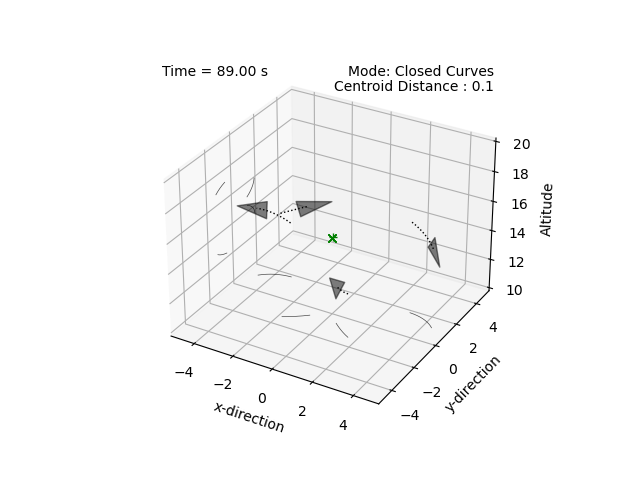
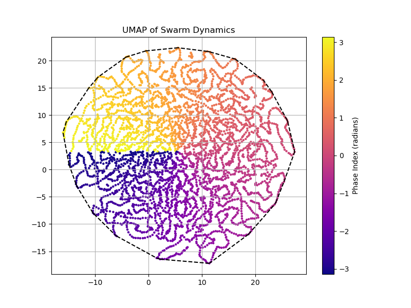

# Control Linearization and Dimensionality Reduction using UMAP: Application to Swarms

A paper published in the journal *Automatica* titled ["Emergent homeomorphic curves in swarms"](https://doi.org/10.1016/j.automatica.2025.112221) investigates the emergent self-organization of multi-agent swarms into closed, periodic trajectories. The central innovation lies in the use of an injective [circular embedding](https://ieeexplore.ieee.org/abstract/document/10741086) induced by the agent dynamics.  

This embedding serves as a structure-preserving map around which all agents stabilize their relative positions, permitting the use of well-established linear control techniques. Moreover, each agent makes decisions based only on local observations, without knowing its role in the broader trajectory. The strategy is fully decentralized, robust to failure or corruption of individual agents, and practically infinitely scalable. The embedding is constructed through a family of topological homeomorphisms, thereby preserving the system’s stability characteristics. This approach relies on rigorous mathematical formulations to design an embedding specific to a desired trajectory—nominally, a [twisted circle](https://github.com/tjards/twisted_circles)—with a critical design parameter: phase.

The embedding can also be viewed as a dimensionality reduction of the control problem, with phase acting as a bridge between the latent space and the physical geometry. In this project, we use [Uniform Manifold Approximation and Projection (UMAP)](https://github.com/lmcinnes/umap) to illustrate that swarm dynamics indeed lie on a circular manifold in latent space. We reconstruct the phase as a critical design parameter *without explicitly providing it to the model*. This effectively "discovers" the circular embedding described in the paper using purely data-driven methods.

## Setup

We collected 3D data from a small swarm of four agents using the [Multi-agent Simulator](https://github.com/tjards/multi-agent_sim) developed by [@tjards](https://github.com/tjards). We then constructed a sequence dataset from position, velocity, and control inputs using a sliding window. The data was then embedded into 2D using UMAP.

We use atypical UMAP hyperparameters:
- A small value for *n_neighbors*, reflecting each agent's reliance on observations of its immediate neighbors only.
- A large value for *min_dist*, emphasizing our interest in the broader emergent structure of the swarm.

Below is an illustration of the swarm trajectory:


      
    <figcaption style="font-size: 1em; margin-top: 5px;"><strong>Figure 1:</strong> Four agents forming a lemniscate.</figcaption>



## Results

Below is an illustration of the UMAP embedding:


      
    <figcaption style="font-size: 1em; margin-top: 5px;"><strong>Figure 2:</strong> UMAP discovers that agents lie on a circular manifold in latent space.</figcaption>


Here, UMAP reveals the underlying structure of the swarm behavior by unfolding it into a circular manifold.  
When we color the embedding based on phase — measured as the angular position of each agent relative to the swarm's center — we observe a clear correlation, highlighting the fundamental role phase plays in the control strategy.


